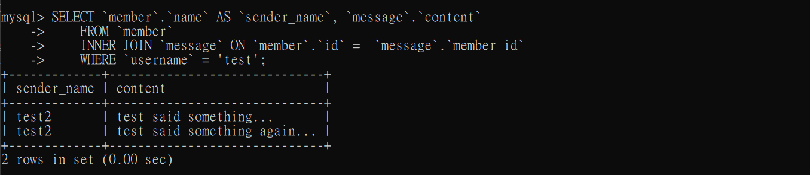

# Week 5

## Task1: Install MySQL server
download_version: `Windows (x86, 64-bit), MSI Installer`

## Task2: Create database and table in MySQL server

- create new database named `website`
    ```sql
    CREATE DATABASE `website`;
    ```
    

- create a new table named `member` in the `website` database. designed as below.
    
    | Column Name | Data Type | Additional Settings | Description |
    | ---- | ---- | ---- | ----|
    | id | bigint | primary key, auto increment | Unique ID |
    | name | varchar(255) | not null | Name |
    | username | varchar(255) | not null | Username |
    | password | varchar(255) | not null | Password |
    | follower_count | int unsigned | not null, default to 0 | Follower Count |
    | time | datetime | not null, default to current time | Signup Time |
    
    ```sql
    USE `website`;
    CREATE TABLE `member`(
        `id` BIGINT AUTO_INCREMENT,
        `name` VARCHAR(255) NOT NULL,
        `username` VARCHAR(255) NOT NULL,
        `password` VARCHAR(255) NOT NULL,
        `follower_count` INT UNSIGNED NOT NULL DEFAULT '0', 
        `time` DATETIME NOT NULL DEFAULT CURRENT_TIMESTAMP,
        PRIMARY KEY(`id`)
    );
    SHOW TABLES;
    ```
    

## Task3: SQL CRUD

- INSERT a new row to the member table where name, username and password must be set to test. INSERT additional 4 rows with rbitrary data.
    ```sql
    INSERT INTO `member` (`name`, `username`, `password`)
    VALUES ('test','test','test');
    INSERT INTO `member` (`name`, `username`, `password`)
    VALUES ('Jane','jane01','pw01');
    INSERT INTO `member` (`name`, `username`, `password`, `follower_count`)
    VALUES ('John','johnxx','pw02','30');
    INSERT INTO `member` (`name`, `username`, `password`,`follower_count`)
    VALUES ('Bob','bobby','pw03','180');
    INSERT INTO `member` (`name`, `username`, `password`,`follower_count`)
    VALUES ('Kate','katie','pe04','100');
    ```
    
- SELECT all rows from the member table.
    ```sql
    SELECT * FROM `member`;
    ```
    
- SELECT all rows from the member table, in descending order of time.
    ```sql
    SELECT * FROM `member`
    ORDER BY `time` DESC;
    ```
    
- SELECT total 3 rows, second to fourth, from the member table, in descending order of time. **Note: it does not mean SELECT rows where id are 2, 3, or 4.**
    ```sql
    WITH `temp` AS (
    SELECT *, ROW_NUMBER() OVER (ORDER BY `time` DESC) AS `ordered_time`
    FROM `member` 
    LIMIT 1,3
    )
    SELECT `id`, `username`, `password`, `follower_count`, `time`
    FROM `temp`;
    ```
    
- SELECT rows where username equals to test.
    ```sql
    SELECT * FROM `member`
    WHERE `username` = 'test';
    ```
    
- SELECT rows where name includes the es keyword.
    ```sql
    SELECT * FROM `member`
    WHERE `name` LIKE '%es%';
    ```
    
- SELECT rows where both username and password equal to test.
    ```sql
    SELECT * FROM `member`
    WHERE `username` = 'test' AND `password` = 'test';
    ```
    
-  UPDATE data in name column to test2 where username equals to test.
    ```sql
    UPDATE `member`
    SET `name` = 'test2'
    WHERE `username` = 'test';
    SELECT * FROM `member`;
    ```
    

## Task4: SQL Aggregation Functions

- SELECT how many rows from the member table.
    ```sql
    SELECT COUNT(*) as `row_count`
    FROM `member`;
    ```
    
- SELECT the sum of follower_count of all the rows from the member table.
    ```sql
    SELECT SUM(`follower_count`) as `sum_of_follower_count`
    FROM `member`;
    ```
    
- SELECT the average of follower_count of all the rows from the member table.
    ```sql
    SELECT AVG(`follower_count`) as `avg_of_follower_count`
    FROM `member`;
    ```
    
-  SELECT the average of follower_count of the first 2 rows, in descending order of follower_count, from the member table.
    ```sql
    WITH `temp` AS (
        SELECT * FROM `member`
        ORDER BY `follower_count` DESC
        LIMIT 2
    )
    SELECT AVG(`follower_count`) as `avg_of_first_2_rows` 
    FROM `temp`;
    ```
    
## Task 5: SQL JOIN 

- Create a new table named message, in the website database. designed as below:

    | Column Name | Data Type | Additional Settings | Description |
    | ---- | ---- | ---- | ----|
    | id | bigint | primary key, auto increment | Unique ID |
    | member_id | bigint | not null, foreign key refer to id column in the member table | Member ID for Message Sender |
    | content | varchar(255) | not null | Content |
    | like_count | int unsigned | not null, default to 0 | Like Count |
    | time | datetime | not null, default to current time | Publish Time |

    ```sql
    USE `website`;
    CREATE TABLE `message` (
        `id` BIGINT AUTO_INCREMENT UNIQUE,
        `member_id` BIGINT NOT NULL,
        `content` VARCHAR(255) NOT NULL,
        `like_count` INT UNSIGNED NOT NULL DEFAULT '0',
        `time` DATETIME NOT NULL DEFAULT CURRENT_TIMESTAMP,
        PRIMARY KEY (`id`),
        FOREIGN KEY (`member_id`) REFERENCES `member`(`id`)
    );
    -- add data:
    INSERT INTO `message`(`member_id`, `content`, `like_count`)
    VALUES ('3','John said something...','12');
    INSERT INTO `message`(`member_id`, `content`, `like_count`)
    VALUES ('5','Kate said something...','32');
    INSERT INTO `message`(`member_id`, `content`, `like_count`)
    VALUES ('1','test said something...','5');
    INSERT INTO `message`(`member_id`, `content`, `like_count`)
    VALUES ('2','Jane said something...','57');
    INSERT INTO `message`(`member_id`, `content`, `like_count`)
    VALUES ('4','Bob said something...','99');
    INSERT INTO `message`(`member_id`, `content`, `like_count`)
    VALUES ('1','test said something again...','78');
    SELECT * FROM `message`;
    ```
    
    
    
- SELECT all messages, including sender names. We have to JOIN the member table to get that.
    ```sql
    SELECT `member`.`name` AS `sender_name`, `message`.`content` 
    FROM `member`
    INNER JOIN `message` ON `member`.`id` =  `message`.`member_id`;
    ```
    
- SELECT all messages, including sender names, where sender `username` equals to test. We have to JOIN the member table to filter and get that.
    ```sql
    SELECT `member`.`name` AS `sender_name`, `message`.`content` 
    FROM `member`
    INNER JOIN `message` ON `member`.`id` =  `message`.`member_id`
    WHERE `username` = 'test';
    ```
    
- Use SELECT, SQL Aggregation Functions with JOIN statement, get the average like count of messages where sender `username` equals to test.
    ```sql
    WITH `temp` AS (
        SELECT `member`.`username` AS `sender_username`, `message`.`like_count` 
        FROM `member`
        INNER JOIN `message` ON `member`.`id` =  `message`.`member_id`
        WHERE `username` IN ('test')
    )
    SELECT `sender_username`, AVG(`like_count`) AS `avg_like_count`
    FROM `temp`;
    ```
    
- Use SELECT, SQL Aggregation Functions with JOIN statement, get the average like count of messages GROUP BY sender `username`.
    ```sql
    WITH `temp` AS (
        SELECT `member`.`username` AS `sender_username`, `message`.`like_count` 
        FROM `member`
        INNER JOIN `message` ON `member`.`id` =  `message`.`member_id`
    )
    SELECT `sender_username`, AVG(`like_count`) AS `avg_like_count`
    FROM `temp`
    GROUP BY `sender_username`;
    ```
    

- Use mysqldump command to export the website database to a file named data.sql.
  